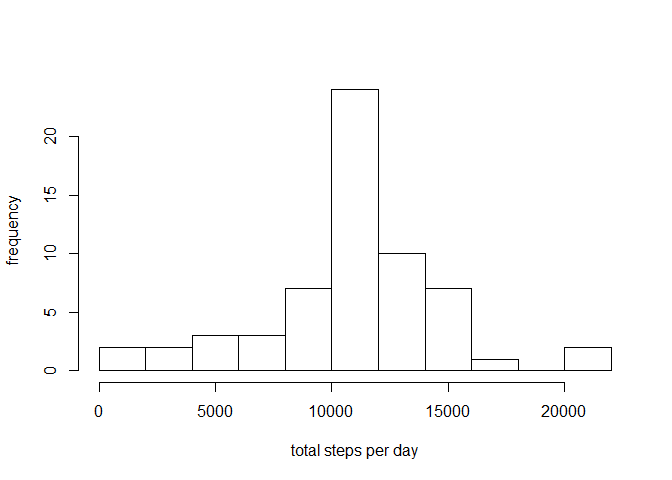
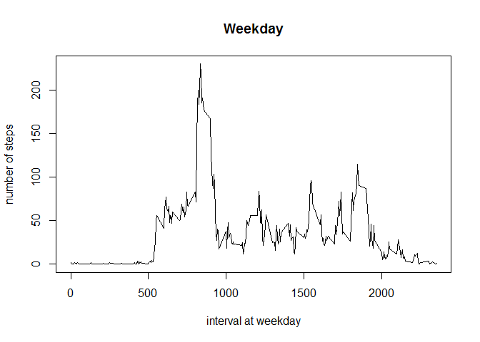

# Reproducible Research: Peer Assessment 1


## Loading and preprocessing the data

First, we read the date.

```r
act <- read.csv("data/reproducible_research/activity.csv", header = T)
```

Then, let's see the structure of our dataset.

```r
str(act)
```

```
## 'data.frame':	17568 obs. of  3 variables:
##  $ steps   : int  NA NA NA NA NA NA NA NA NA NA ...
##  $ date    : Factor w/ 61 levels "2012-10-01","2012-10-02",..: 1 1 1 1 1 1 1 1 1 1 ...
##  $ interval: int  0 5 10 15 20 25 30 35 40 45 ...
```

Let's check the dimensions and a few rows.

```r
dim(act)
```

```
## [1] 17568     3
```

```r
head(act)
```

```
##   steps       date interval
## 1    NA 2012-10-01        0
## 2    NA 2012-10-01        5
## 3    NA 2012-10-01       10
## 4    NA 2012-10-01       15
## 5    NA 2012-10-01       20
## 6    NA 2012-10-01       25
```
The previous output shows we have indeed the number of observations and variables mentioned in the assignment description, and we can see that during the first day of data collection we have several intervals with missing values that we will need to deal later with.

## What is mean total number of steps taken per day?
We use dplyr package to group and summarize the data.

```r
library(dplyr)
```

```
## 
## Attaching package: 'dplyr'
## 
## The following objects are masked from 'package:stats':
## 
##     filter, lag
## 
## The following objects are masked from 'package:base':
## 
##     intersect, setdiff, setequal, union
```

```r
act1 <- group_by(act,date)
ave_per_day <- summarize(act1, total=sum(steps, na.rm=T), mean = mean(steps, na.rm = T),
                         median = median(steps, na.rm = T))
```

Once the summaries are calculated, we construct the histogram of the total steps:

```r
hist(ave_per_day$total, breaks = 15, ylab = "frequency", xlab="total steps per day", main="")
```

 

```r
summary(ave_per_day$total)
```

```
##    Min. 1st Qu.  Median    Mean 3rd Qu.    Max. 
##       0    6778   10400    9354   12810   21190
```

Let's get a summary of the data, which will include the mean and the median, to get a more quantitative insight of the data:

```r
summary(ave_per_day$total)
```

```
##    Min. 1st Qu.  Median    Mean 3rd Qu.    Max. 
##       0    6778   10400    9354   12810   21190
```

```r
summary(ave_per_day$mean)
```

```
##    Min. 1st Qu.  Median    Mean 3rd Qu.    Max.    NA's 
##  0.1424 30.7000 37.3800 37.3800 46.1600 73.5900       8
```
Observe that the mean and the median of the total steps are close in value, but also that there are 8 missing values.

## What is the average daily activity pattern?
In this section we will average the number of steps across each 5 min interval, this will give us an idea of the periods where the person might be the most and the least active.

We group the data by interval this time and then calculate the mean of each interval goup:

```r
act2 <- group_by(act, interval)
ave_interval <- summarize(act2, mean = mean(steps, na.rm = T))
plot(ave_interval$interval, ave_interval$mean, type = "l", xlab = "interval", ylab = "mean of steps")
max_point <- ave_interval[ave_interval$mean== max(ave_interval$mean),]
points(max_point$interval, max_point$interval, col="red",pch=11)
```

 
We can observe the largest amount of steps occurs between time intervals 500 and 1000. The maximum average number of steps is: 206 and occurs in time interval #835

## Imputing missing values
We noticed that there are missing values when we printed the first few rows of the act data, but so far we have not determined how many values are missing. The following lines will calculate the percentage of missing data as well as the number of rows that contain an NA.


```r
sum(is.na(act))
```

```
## [1] 2304
```

```r
mean(is.na(act$steps))
```

```
## [1] 0.1311475
```
About 13% of the data is missing. 

We are going to using the average steps per interval to fill in the NAs.

```r
act3 <- act
for (i in 1:dim(act3)[1]) {
    if (is.na(act3$steps[i])) {
        act3$steps[i]= as.numeric(ave_interval[ave_interval$interval==act3$interval[i],2])
    }
}
newdata <- group_by(act3, date)
```

And we can construct the histogram:

```r
ave_newdata <- summarize(newdata, total=sum(steps), mean = mean(steps))

hist(ave_newdata$total, breaks = 15, ylab = "frequency", xlab="total steps per day", main="")
```

 

This figure shows, similarly to the first histogram, symmetrically distributed data around the maximum without the column in the extreme left (which contained the days with missing data). One must notice that filling values with the interval means increases the frequencies in the 10000-12500 class, which contains the median.


```r
## compare the mean and sd before and after mutating NA, we see the sd decrease 40%,
summary(ave_per_day$total)
```

```
##    Min. 1st Qu.  Median    Mean 3rd Qu.    Max. 
##       0    6778   10400    9354   12810   21190
```

```r
sd(ave_per_day$total)
```

```
## [1] 5405.895
```

```r
summary(ave_newdata$total)
```

```
##    Min. 1st Qu.  Median    Mean 3rd Qu.    Max. 
##      41    9819   10770   10770   12810   21190
```

```r
sd(ave_newdata$total)
```

```
## [1] 3974.391
```
The mean and the median stay the same, however the 1st quantile of the new data slides closer to the mean. When we look at the standard deviation values, we can also observe that the new data has a smaller standard deviation, thus the effect of imputing NAs with the mean values for the time intervals is a decrease in the spread, we obtained a distribution that is more concentrated around the center of gravity.

## Are there differences in activity patterns between weekdays and weekends?
Different weekend vs weekday patterns are expected as people, in general, have a different set of activities on weekends.
In order to find the specific patterns for each set of days, we will identify the weekdays from the weekend data. 

```r
## make the act4$date varialbe a factor, labeled with weekday and weekend. 
act4 <- act3
act4$date <- weekdays(as.Date((as.character(act$date))))
act4$date[!(act4$date %in% c("Saturday", "Sunday"))] <- "Weekday"
act4$date[act4$date %in% c("Saturday", "Sunday")] <- "Weekend"
act4$date <- factor(act4$date, levels = c("Weekday","Weekend"))

## 
wday <- filter(act4, date=="Weekday")
wend <- filter(act4, date=="Weekend")

wday1 <- wday %>% group_by(interval) %>% summarize(total=sum(steps), mean= mean(steps))
wend1 <- wend %>% group_by(interval) %>% summarize(total=sum(steps), mean= mean(steps))

plot(wday1$interval, wday1$mean, type = "l", main="Weekday", 
     xlab = "interval at weekday", ylab = "number of steps")
```

 

```r
plot(wend1$interval, wend1$mean, type = "l", main="Weekend", 
     xlab = "interval at weekend", ylab = "number of steps")
```

 

We observe that, as expected, the activity profiles between weekdays and weekends greatly differ. During the weekdays, activity peaks in the morning between 7 and 9 and then the activity remains below ~100 steps. In contrast, the weekend data does not show a period with particularly high level of activity, but the activity remains higher than the weekday activity at most times and in several instances it surpases the 100 steps mark and it is overall more evenly distributed throughout the day.
